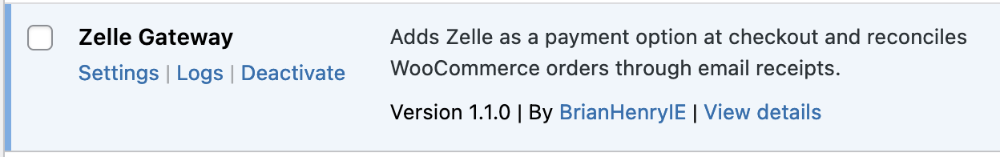
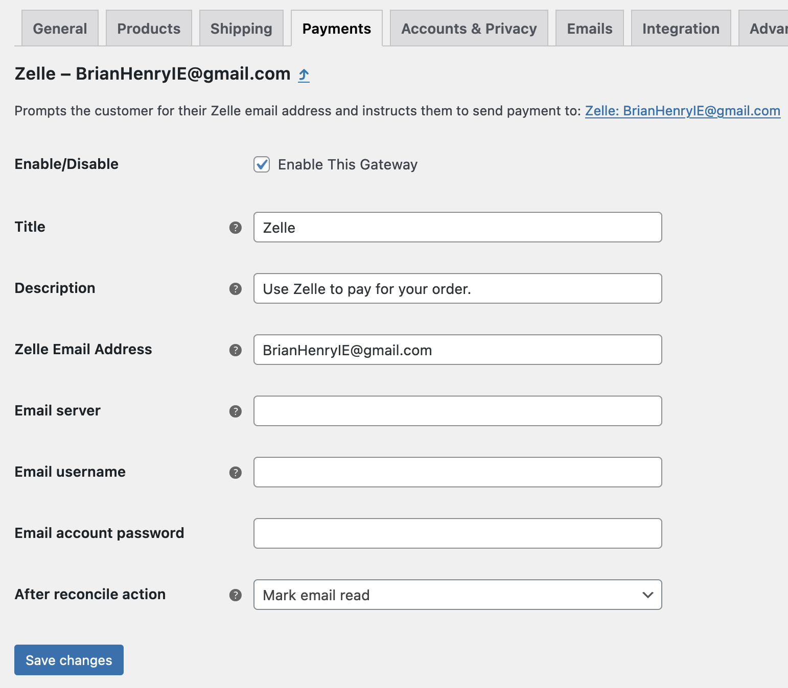
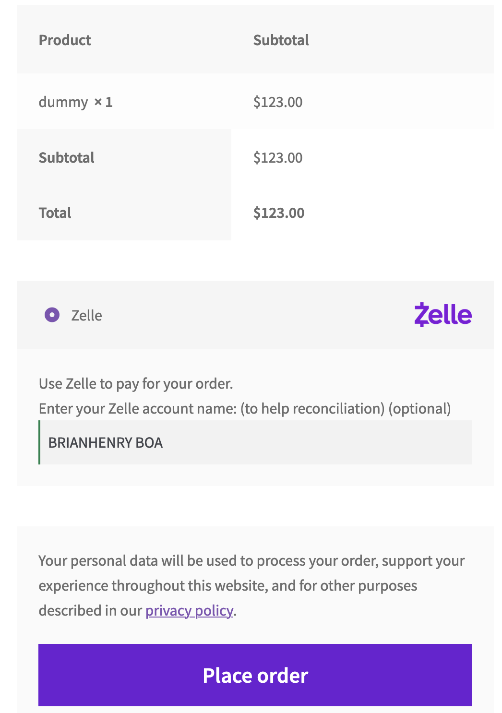
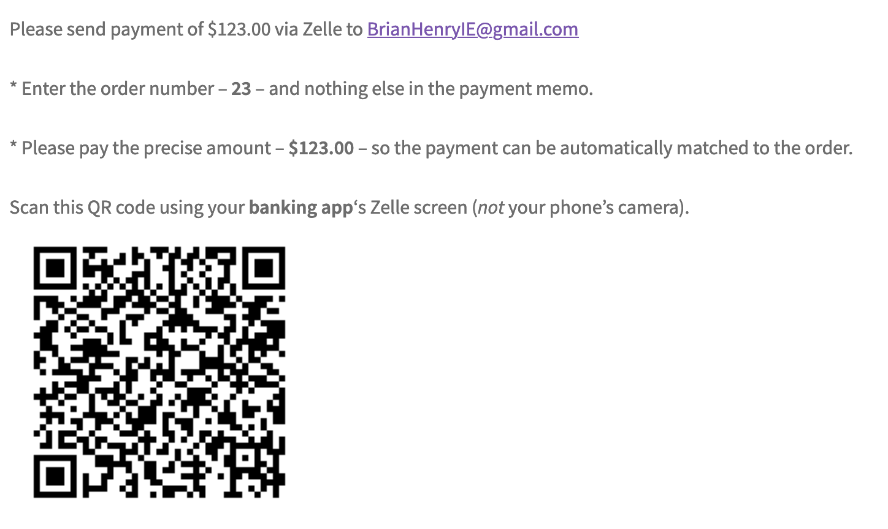
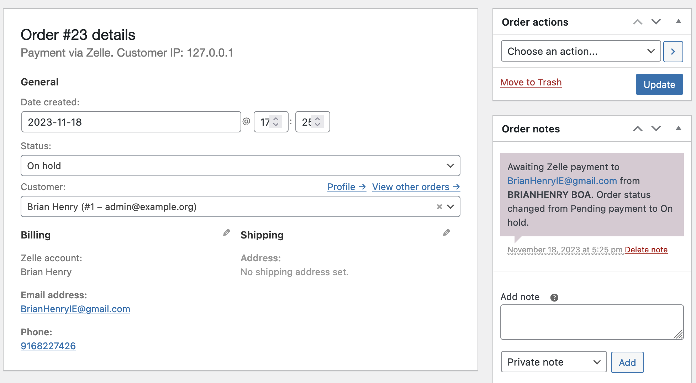

[](https://wordpress.org/) [](https://github.com/WordPress-Coding-Standards/WordPress-Coding-Standards) [](https://github.com/szepeviktor/phpstan-wordpress) [](https://brianhenryie.github.io/bh-wc-zelle-gateway/)

# Zelle Payment Gateway for WooCommerce

> [Download plugin zip](https://github.com/BrianHenryIE/bh-wc-zelle-gateway/releases)

`wp-admin/plugins.php`



`wp-admin/admin.php?page=wc-settings&tab=checkout&section=zelle`



`checkout/`



`checkout/order-received/123/`



`wp-admin/admin.php?page=wc-orders&action=edit&id=123`




## Notes

```bash
wp option delete bh-wc-zelle-gateway-last-imap-reconcile-run-time;
wp cron event run bh_wc_zelle_gateway_check_for_payment_emails;
```

The billing address does not get saved to the shipping address if there is no shipping method available.

https://twitter.com/jdcmedlock/status/1606707029388972032

## TODO:

* Lots